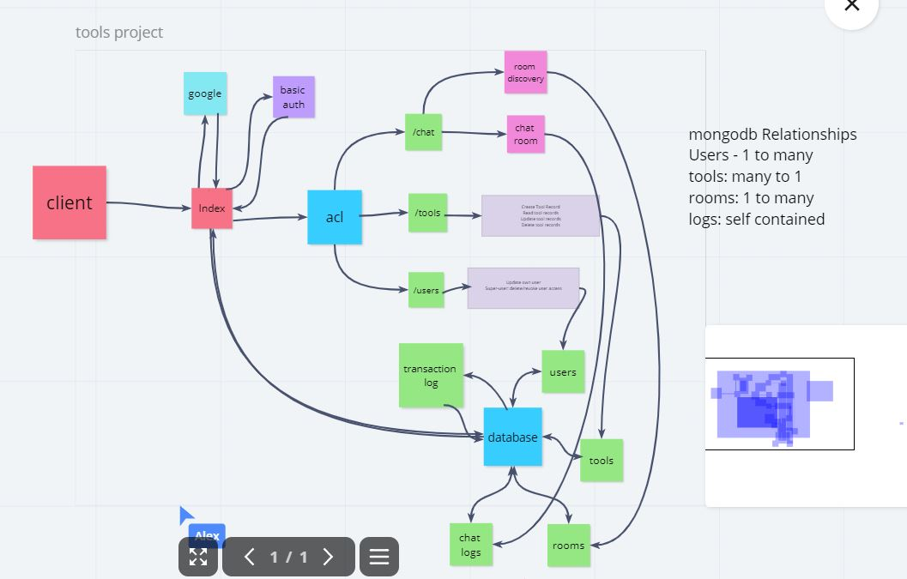

# Hey Neighbor!

## Authors

- Morgan Heinemann
- Wenhao Piao
- Alex Pena
- Alex Pederson

## Project Overview

- `Hey Neighbor!` is a neighborhood focused tool loaning and communication service
- `Non-Users` are able to query tools available in their local area to get an idea if they would like to join the service
- `Users` are initially assigned a neighborhood geographically but can join other groups for discussions as well
- `Users` are able to create a record of tools they own and are willing to loan out to other users, as well as maintain a transaction history of who has what at any given time
- `Tools` have a multi-step check-out and check-in process to ensure approval from all parties and these steps are stored in a larger log file for easy reference
- `Tools` and `Users` can have reviews indicating their overall quality, punctuality, and function. This provides feedback to `Users` on both sides of the transaction as to the state of the tool or the character of the individual
- `Chat rooms` are designated geographically and are the means by which people can talk as well as initiate a formal request to borrow tools.

## Tools Used

- `Google` for Oauth
- `MongoDB` for data retention

### Domain Model

