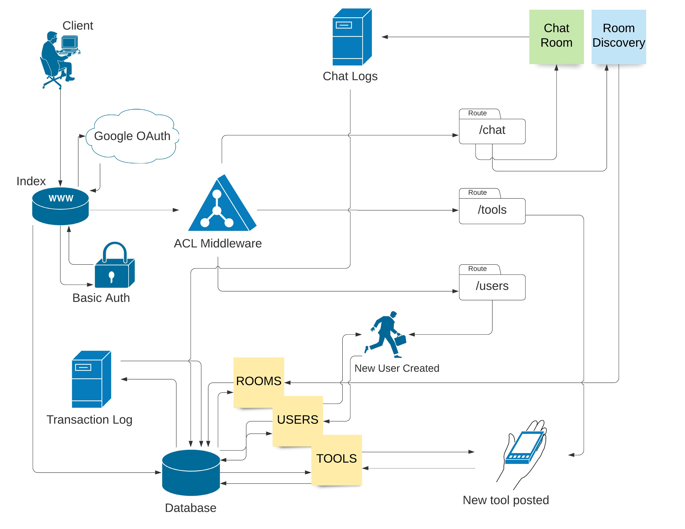

# Hey Neighbor!

## Authors

- Morgan Heinemann
- Wenhao Piao
- Alex Pena
- Alex Pederson

## Project Overview

- `Hey Neighbor!` is a neighborhood focused tool loaning and communication service
- `Non-Users` are able to query tools available in their local area to get an idea if they would like to join the service
- `Users` are initially assigned a neighborhood geographically but can join other groups for discussions as well
- `Users` are able to create a record of tools they own and are willing to loan out to other users, as well as maintain a transaction history of who has what at any given time
- `Tools` have a multi-step check-out and check-in process to ensure approval from all parties and these steps are stored in a larger log file for easy reference
- `Tools` and `Users` can have reviews indicating their overall quality, punctuality, and function. This provides feedback to `Users` on both sides of the transaction as to the state of the tool or the character of the individual
- `Chat rooms` are designated geographically and are the means by which people can talk as well as initiate a formal request to borrow tools.

## Tools Used

- `Google` for Oauth
- `MongoDB` for data retention
- [`Trello`](https://trello.com/b/57y9roix/team-401d35) for task tracking 

### Domain Model

### .env file setup
* Create your own .env file in root folder
* PORT=3000
* MONGODB_URL=mongodb://localhost/hey-neighbor
* OAUTH_CLIENT_ID=444667393820-6rpjjjaepv6lu63oecpe61e6698bd01s.apps.googleusercontent.com
* OAUTH_SECRET_ID=M_xA5KS1W5S4B09Zdr7YmrVb
* GOOGLE_APPLICATION_CREDENTIALS=../backend/Google Aouth/auth/client_secret_444667393820-6rpjjjaepv6lu63oecpe61e6698bd01s.apps.googleusercontent.com.json

### Generic Model 
This generic model supports basic mongoDB CRUD operations. This is for creating dynamic model later.
* `create(record)`: create a record in the DB and return it
* `get(_id)`: return a record by _id from the DB; if _id is not given, it will return all the records from the DB
* `update(_id, record)`: update a record in the DB by _id and return updated record
* `delete(_id)`: delete a record in the DB by _id and return deleted record

### Schemas

### API Routes

### Tests
* generic model: Run Command `__tests__/model.test.js --verbose --coverage`

